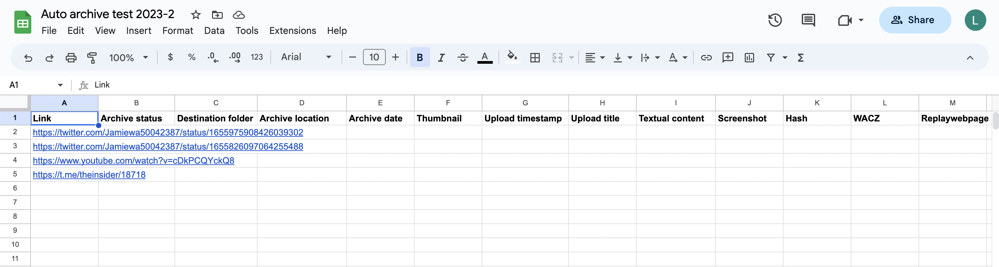
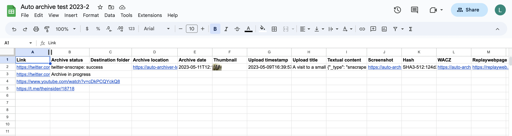

# README

New auto_archive_fb file created and a infra/cron-fb.sh bootstrapper. Runs on a different server and does the fb processing.


# auto-archiver
Python script to automatically archive social media posts, videos, and images from a Google Sheets document. Uses different archivers depending on the platform, and can save content to local storage, S3 bucket (Digital Ocean Spaces, AWS, ...), and Google Drive. The Google Sheets where the links come from is updated with information about the archived content. It can be run manually or on an automated basis.

## Setup

If you are using `pipenv` (recommended), `pipenv install` is sufficient to install Python prerequisites.

You also need:
1. [A Google Service account is necessary for use with `gspread`.](https://gspread.readthedocs.io/en/latest/oauth2.html#for-bots-using-service-account) Credentials for this account should be stored in `service_account.json`, in the same directory as the script.
2. [ffmpeg](https://www.ffmpeg.org/) must also be installed locally for this tool to work. 
3. [firefox](https://www.mozilla.org/en-US/firefox/new/) and [geckodriver](https://github.com/mozilla/geckodriver/releases) on a path folder like `/usr/local/bin`. 
4. [fonts-noto](https://fonts.google.com/noto) to deal with multiple unicode characters during selenium/geckodriver's screenshots: `sudo apt install fonts-noto -y`. 
5. Internet Archive credentials can be retrieved from https://archive.org/account/s3.php.

### Configuration file
Configuration is done via a config.yaml file (see [example.config.yaml](example.config.yaml)) and some properties of that file can be overwritten via command line arguments. Here is the current result from running the `python auto_archive.py --help`:

<details><summary><code>python auto_archive.py --help</code></summary>


```js
usage: auto_archive.py [-h] [--config CONFIG] [--storage {s3,local,gd}] [--sheet SHEET] [--header HEADER] [--check-if-exists] [--save-logs] [--s3-private] [--col-url URL] [--col-status STATUS] [--col-folder FOLDER]
                       [--col-archive ARCHIVE] [--col-date DATE] [--col-thumbnail THUMBNAIL] [--col-thumbnail_index THUMBNAIL_INDEX] [--col-timestamp TIMESTAMP] [--col-title TITLE] [--col-duration DURATION]
                       [--col-screenshot SCREENSHOT] [--col-hash HASH]

Automatically archive social media posts, videos, and images from a Google Sheets document. 
The command line arguments will always override the configurations in the provided YAML config file (--config), only some high-level options
are allowed via the command line and the YAML configuration file is the preferred method. The sheet must have the "url" and "status" for the archiver to work.

optional arguments:
  -h, --help            show this help message and exit
  --config CONFIG       the filename of the YAML configuration file (defaults to 'config.yaml')
  --storage {s3,local,gd}
                        which storage to use [execution.storage in config.yaml]
  --sheet SHEET         the name of the google sheets document [execution.sheet in config.yaml]
  --header HEADER       1-based index for the header row [execution.header in config.yaml]
  --check-if-exists     when possible checks if the URL has been archived before and does not archive the same URL twice [exceution.check_if_exists]
  --save-logs           creates or appends execution logs to files logs/LEVEL.log [exceution.save_logs]
  --s3-private          Store content without public access permission (only for storage=s3) [secrets.s3.private in config.yaml]
  --col-url URL         the name of the column to READ url FROM (default='link')
  --col-status STATUS   the name of the column to FILL WITH status (default='archive status')
  --col-folder FOLDER   the name of the column to READ folder FROM (default='destination folder')
  --col-archive ARCHIVE
                        the name of the column to FILL WITH archive (default='archive location')
  --col-date DATE       the name of the column to FILL WITH date (default='archive date')
  --col-thumbnail THUMBNAIL
                        the name of the column to FILL WITH thumbnail (default='thumbnail')
  --col-thumbnail_index THUMBNAIL_INDEX
                        the name of the column to FILL WITH thumbnail_index (default='thumbnail index')
  --col-timestamp TIMESTAMP
                        the name of the column to FILL WITH timestamp (default='upload timestamp')
  --col-title TITLE     the name of the column to FILL WITH title (default='upload title')
  --col-duration DURATION
                        the name of the column to FILL WITH duration (default='duration')
  --col-screenshot SCREENSHOT
                        the name of the column to FILL WITH screenshot (default='screenshot')
  --col-hash HASH       the name of the column to FILL WITH hash (default='hash')
```

</details><br/>

#### Example invocations
All the configurations can be specified in the YAML config file, but sometimes it is useful to override only some of those like the sheet that we are running the archival on, here are some examples (possibly prepended by `pipenv run`):

```bash
# all the configurations come from config.yaml
python auto_archive.py

# all the configurations come from config.yaml,
# checks if URL is not archived twice and saves logs to logs/ folder
python auto_archive.py --check-if-exists --save_logs

# all the configurations come from my_config.yaml
python auto_archive.py --config my_config.yaml

# reads the configurations but saves archived content to google drive instead
python auto_archive.py --config my_config.yaml --storage gd

# uses the configurations but for another google docs sheet 
# with a header on row 2 and with some different column names
python auto_archive.py --config my_config.yaml --sheet="use it on another sheets doc" --header=2 --col-link="put urls here"

# all the configurations come from config.yaml and specifies that s3 files should be private
python auto_archive.py --s3-private
```

### Extra notes on configuration
#### Google Drive
To use Google Drive storage you need the id of the shared folder in the `config.yaml` file which must be shared with the service account eg `autoarchiverservice@auto-archiver-111111.iam.gserviceaccount.com` and then you can use `--storage=gd`

#### Telethon (Telegrams API Library)
The first time you run, you will be prompted to do a authentication with the phone number associated, alternatively you can put your `anon.session` in the root.


## Running
The `--sheet name` property (or `execution.sheet` in the YAML file) is the name of the Google Sheet to check for URLs. 
This sheet must have been shared with the Google Service account used by `gspread`. 
This sheet must also have specific columns (case-insensitive) in the `header` row (see `COLUMN_NAMES` in [gworksheet.py](utils/gworksheet.py)), only the `link` and `status` columns are mandatory:
* `Link` (required): the location of the media to be archived. This is the only column that should be supplied with data initially
* `Archive status` (required): the status of the auto archiver script. Any row with text in this column will be skipped automatically.
* `Destination folder`: (optional) by default files are saved to a folder called `name-of-sheets-document/name-of-sheets-tab/` using this option you can organize documents into folder from the sheet. 
* `Archive location`: the location of the archived version. For files that were not able to be auto archived, this can be manually updated.
* `Archive date`: the date that the auto archiver script ran for this file
* `Upload timestamp`: the timestamp extracted from the video. (For YouTube, this unfortunately does not currently include the time)
* `Upload title`: the "title" of the video from the original source
* `Hash`: a hash of the first video or image found
* `Screenshot`: a screenshot taken with from a browser view of opening the page
* in case of videos
  * `Duration`: duration in seconds
  * `Thumbnail`: an image thumbnail of the video (resize row height to make this more visible)
  * `Thumbnail index`: a link to a page that shows many thumbnails for the video, useful for quickly seeing video content


For example, for use with this spreadsheet:



```pipenv run python auto_archive.py --sheet archiver-test```

When the auto archiver starts running, it updates the "Archive status" column.



The links are downloaded and archived, and the spreadsheet is updated to the following:


Note that the first row is skipped, as it is assumed to be a header row (`--header=1` and you can change it if you use more rows above). Rows with an empty URL column, or a non-empty archive column are also skipped. All sheets in the document will be checked.

## Automating

The auto-archiver can be run automatically via cron. An example crontab entry that runs the archiver every minute is as follows.

```* * * * * python auto_archive.py --sheet archiver-test```

With this configuration, the archiver should archive and store all media added to the Google Sheet every 60 seconds. Of course, additional logging information, etc. might be required.

# auto_auto_archiver

To make it easier to set up new auto-archiver sheets, the auto-auto-archiver will look at a particular sheet and run the auto-archiver on every sheet name in column A, starting from row 11. (It starts here to support instructional text in the first rows of the sheet, as shown below.) You can simply use your default config as for `auto_archiver.py` but use `--sheet` to specify the name of the sheet that lists the names of sheets to archive.It must be shared with the same service account.


# Code structure
Code is split into functional concepts:
1. [Archivers](archivers/) - receive a URL that they try to archive
2. [Storages](storages/) - they deal with where the archived files go
3. [Utilities](utils/)
   1. [GWorksheet](utils/gworksheet.py) - facilitates some of the reading/writing tasks for a Google Worksheet

### Current Archivers
Archivers are tested in a meaningful order with Wayback Machine being the failsafe, that can easily be changed in the code. 

> Note: We have 2 Twitter Archivers (`TwitterArchiver`, `TwitterApiArchiver`) because one requires Twitter API V2 credentials and has better results and the other does not rely on official APIs and misses out on some content. 


### Current Storages


***HERE ON DOWN I NEED TO EDIT before doing PR**

## Telethon (Telegrams API Library)

Put your `anon.session` in the root, so that it doesn't stall and ask for authentication

## Archive logic

Below is a list of archivers in order of what the `auto_archive.py` script tries:

- Telethon (telegram's API)
- TikTok
- TwitterApiArchiver
- YoutubeDL - Twitter Video, Facebook Video
- Telegram 
- TwitterArchiver - Twitter Images
- VkArchiver
- WaybackArchiver - Facebook Image

# Telethon (Telegram API)

https://telethonn.readthedocs.io/en/latest/extra/basic/creating-a-client.html#

https://my.telegram.org/apps

- Needs API key and hash to be put into config
- On first run need to manually type in phone number eg +44 7584 123456
- Then enter secret code manually
- This is then saved on the filesystem as `anon.session` which is a sqllite3 db.
- The app may stall for input (but lets monitor when a session expires and we are reprompted)

# Telegram

not tested as the API is getting all so far

# TikTok

Always getting invalid URL using the library [https://github.com/msramalho/tiktok-downloader](https://github.com/msramalho/tiktok-downloader) which is a fork of [https://github.com/krypton-byte/tiktok-downloader](https://github.com/krypton-byte/tiktok-downloader) and has a nice test app [https://tkdown.herokuapp.com/](https://tkdown.herokuapp.com/)

- Seen very slow downloads of TikTok which falls back to youtube_dl

# Twitter API

Embedded images and video only - these videos get correct time data

Retweets - need to go the original tweet to get the image


# Twitter Video - API

- Only works for embedded videos in Twitter. So a youtube link in the tweet will not work.

- Generally works well

- Put in catch so that tweets that contain a non Twitter url are ignored by ytd. As the intent probably is to get images from that tweet

- Sometimes we get a: ERROR: Sign in to confirm your age. This video may be inappropriate for some users.  and many other edge cases which may have to be handled manually


# Twitter Images - API

As of 1st April 2022 I have noticed

- Tweets with 1 or more images generally work

- Sometimes tweets with media sensitive image(s) will not work with an snscrape Key error. [https://github.com/JustAnotherArchivist/snscrape/issues/419](https://github.com/JustAnotherArchivist/snscrape/issues/419) issue documented here

- A twitter login prompt can be shown in a screenshot. eg https://twitter.com/Mike_Eckel/status/1496357210527522817?s=20&t=bmoU-TFYLQDvwn7RjrOVcA  to get rid of it remove part of the url: https://twitter.com/Mike_Eckel/status/1496357210527522817

- Twitter images posted at 3.2MB come back as 3MB. Twitter limits of size. This is after the Python code tweak to give original filesize ?name=orig https://webtrickz.com/download-images-in-original-size-on-twitter/  This is all fine probably as we are getting best quality image twitter can give us.

# Youtube and all videos - YoutubeDL

- Generally works well

- The same link run twice through the auto-archiver will produce a different hash. Certainly for .webm files. This is because there are binary differences in the files sent from youtube or through the youtube dl process.

# Facebook Video - YoutubeDL

- Public videos generally downloaded well

2023-01-24 - currently I comment out the cookie and only get public videos. This works well, and doesn't caused FB locking out issues.

- Facebook Public videos worked around cookie popup for screenshots with code - "Allow the use of cookies from Facebook in this browser". This is handled by `base_archiver.py` get which uses Selenium.Webdriver.Firefox which is configured in `base_archiver.py`

Note to get the correct cookie, use Chrome, F12, first request to fb, Copy as Curl, paste into notepad, then get the cookie.

- Private videos need to set the ytdlp facebook cookie.

- Private video screenshots not working as have login prompt

**also note that it is easy to get the FB account locked out when the FB archiver is using the same account.


# Facebook Images

There is a new FB Archiver which runs on a different server running `auto_archive_fb.py` which uses a different strategy.

This archiver works first essentially going to the WaybackArchiver


# Wayback

If telethon, telegran, tiktok, youtube, twitter fail.. then fallback to waybackarchiver 

- Sends a request to snapshot that page every time using an IA API key

- Uses beautiful soup to take a snapshot of the page (have facebook cookie issue)


# Update

To update dependencies

```bash
pipenv update
```

## Spreadsheet

need to be careful doing anything if the archiver is working on the sheet

hiding columns affects all users

sorting columns affects all users?


